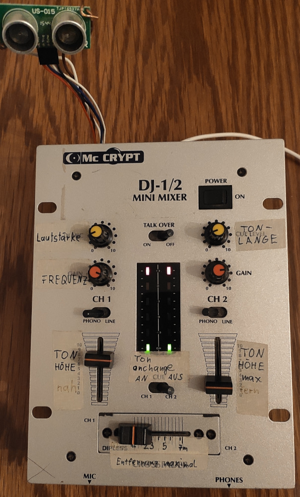

# MihDi
### *Dance your Melody!*

- MIDI device that outputs notes (relative to distance) over USB to synthesizer or other sound engines.
- confirmed working
  - on linux using [ams](https://github.com/royvegard/ams), [vmpk](https://github.com/pedrolcl/VMPK), [qsynth](https://github.com/rncbc/qsynth), [amsynth](https://github.com/amsynth/amsynth)
  - on android using [DRC (Polyphonic Synthesizer)](https://www.imaginando.pt/products/drc-polyphonic-synthesizer)
- powered over USB  
- created in summer 2017

---

## Part list:
- 1 Arduino pro micro (microprocessor board)
- 1 US-015 (ultra sonic distance sensor) 
- 6 Potentiometer 10kOhm (change settings)
- 3 Buttons (change settings)
- 4 LED (show status and frequency)
- 1 (micro)-USB cable (connect to synthesizer or PC)

## Connections 
### to arduino board
| Pin | Device| Usage |
|----|--------|---|
| D2 | ECHO  US-015 | distance sensor receives ultrasonic pulse echo |
| D3 | TRIG  US-015 | trigger distance sensor to send ultrasonic pulse |
| D5 | Button1 | output notes on every valid distance or only on distance changes |
| D9 | Button3 | set/unset a minimal distance you need to move to produce a new note | 
| D14 | LED1  | show frequency of distance measurement |
| D15 | Button2 | change output range between half notes and all notes | 
| D16 | LED2  | light on sound output |
|  |   |  |
| A0 | Pot1 | volume |
| A1 | Pot2 | distance max |
| A2 | Pot3 | sound duration |
| A3 | pot4 | frequency |
| A6 | pot5 | note height near |
| A7 | pot6 | note height far |
| 5V | LED3,4 | show power state |
